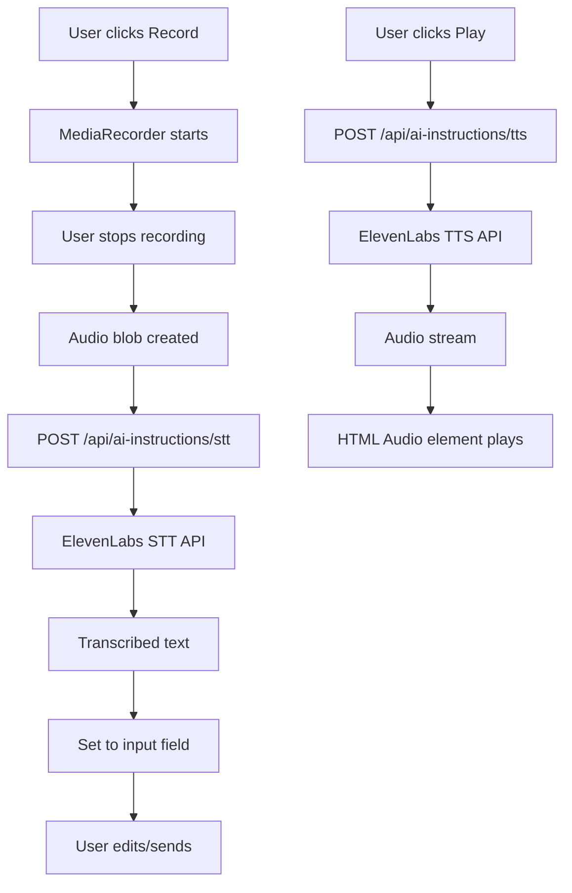

# Voice Features Implementation Plan

## Overview

Add voice recording and playback capabilities to `app/admin/ai-instructions/chat-modal.tsx` while preserving all existing text-based functionality. The implementation includes frontend recording/playback UI and two new API endpoints for ElevenLabs STT and TTS integration.

## Architecture Flow



## Implementation Steps

### 1. Create STT API Endpoint

**File**: `app/api/ai-instructions/stt/route.ts` (new)

- Follow authentication pattern from `app/api/ai-instructions/chat/route.ts`:
  - Check Supabase session
  - Verify `super_admin` role
- Accept `FormData` with audio file (similar to `app/api/ai-instructions/upload/route.ts`)
- POST to ElevenLabs STT API: `https://api.elevenlabs.io/v1/speech-to-text`
  - Use `ELEVENLABS_API_KEY` from environment
  - Send audio file as multipart/form-data
  - Accept audio formats: `audio/wav`, `audio/mpeg`, `audio/webm`
- Return JSON: `{ text: string }`
- Handle errors (quota, auth, invalid audio)

### 2. Create TTS API Endpoint  

**File**: `app/api/ai-instructions/tts/route.ts` (new)

- Reuse authentication pattern from existing endpoints
- Accept JSON: `{ text: string }`
- Use existing TTS implementation pattern from `app/api/ai-instructions/tts-stream/route.ts`:
  - POST to `https://api.elevenlabs.io/v1/text-to-speech/{voiceId}`
  - Use voice ID: `EXAVITQu4vr4xnSDxMaL` (Bella, same as existing)
  - Model: `eleven_turbo_v2_5`
  - Return audio stream with `Content-Type: audio/mpeg`
- Handle errors gracefully

### 3. Frontend: Add Recording State & Logic

**File**: `app/admin/ai-instructions/chat-modal.tsx`

**New State Variables:**

```typescript
const [isRecording, setIsRecording] = useState(false);
const [isTranscribing, setIsTranscribing] = useState(false);
const [playingMessageId, setPlayingMessageId] = useState<string | null>(null);
const [audioUrl, setAudioUrl] = useState<string | null>(null);
const mediaRecorderRef = useRef<MediaRecorder | null>(null);
const audioChunksRef = useRef<Blob[]>([]);
const audioStreamRef = useRef<MediaStream | null>(null);
const audioRef = useRef<HTMLAudioElement | null>(null);
```

**Recording Logic** (based on `components/realtime-chat-gemini.tsx:1206-1418`):

- `toggleRecording()` function:
  - Start: Request microphone via `navigator.mediaDevices.getUserMedia()`
  - Create `MediaRecorder` with audio constraints (echoCancellation, noiseSuppression, autoGainControl)
  - Collect chunks in `audioChunksRef`
  - Stop: Create blob, send to STT endpoint, set transcribed text to input field
- Cleanup: Stop tracks on unmount/stop

### 4. Frontend: Add Playback Logic

**File**: `app/admin/ai-instructions/chat-modal.tsx`

**Playback Function:**

- `handlePlayMessage(messageId: string, text: string)`:
  - If already playing same message, stop/pause
  - Set `playingMessageId` and `isTranscribing` (loading state)
  - POST to `/api/ai-instructions/tts` with message text
  - Convert response blob to object URL
  - Create/use `HTMLAudioElement` to play
  - Clean up URL on playback end/error
  - Reset `playingMessageId` when done

### 5. Frontend: Update UI Components

**File**: `app/admin/ai-instructions/chat-modal.tsx`

**Input Area (line ~311-328):**

- Add Record button next to Send button:
  - Icon: `Mic` when not recording, `MicOff` when recording
  - Show pulsing indicator when `isRecording === true`
  - Disable during `isTranscribing`
  - Position: Between Input and Send button

**Message Display (line ~213-298):**

- Add Play button next to each assistant message:
  - Icon: `Play` when not playing, `Pause` when playing that message
  - Show loading spinner during TTS generation
  - Position: Top-right corner of message bubble
  - Only show for `message.role === "assistant"`

**Visual Indicators:**

- Recording: Pulsing red dot or animated Mic icon
- Transcribing: Spinner next to input field
- Playing: Pause icon + visual indicator on message

### 6. Error Handling & Edge Cases

- Microphone permission denied: Show toast error
- STT/TTS API failures: Show user-friendly error messages
- Audio playback errors: Handle gracefully, reset state
- Cleanup audio streams/tracks on component unmount
- Prevent multiple simultaneous recordings
- Prevent multiple simultaneous TTS requests for same message

### 7. Dependencies

- No new npm packages needed:
  - `MediaRecorder` API (browser native)
  - `HTMLAudioElement` (browser native)
  - `lucide-react` icons already imported
  - `FormData` (browser native)

### 8. Environment Variables

- `ELEVENLABS_API_KEY` - Already configured (used in existing TTS endpoint)

## Files to Modify

1. **`app/admin/ai-instructions/chat-modal.tsx`** - Add recording/playback UI and logic
2. **`app/api/ai-instructions/stt/route.ts`** - New STT endpoint
3. **`app/api/ai-instructions/tts/route.ts`** - New TTS endpoint (or adapt existing tts-stream)

## Testing Checklist

- [ ] Record button starts/stops recording
- [ ] Audio transcription populates input field
- [ ] User can edit transcribed text before sending
- [ ] Play button generates and plays TTS audio
- [ ] Multiple messages can have independent play buttons
- [ ] Recording indicator shows during recording
- [ ] Loading states show during STT/TTS
- [ ] Error handling works for API failures
- [ ] Microphone permission errors handled
- [ ] Audio cleanup on component unmount
- [ ] Existing text chat functionality unchanged